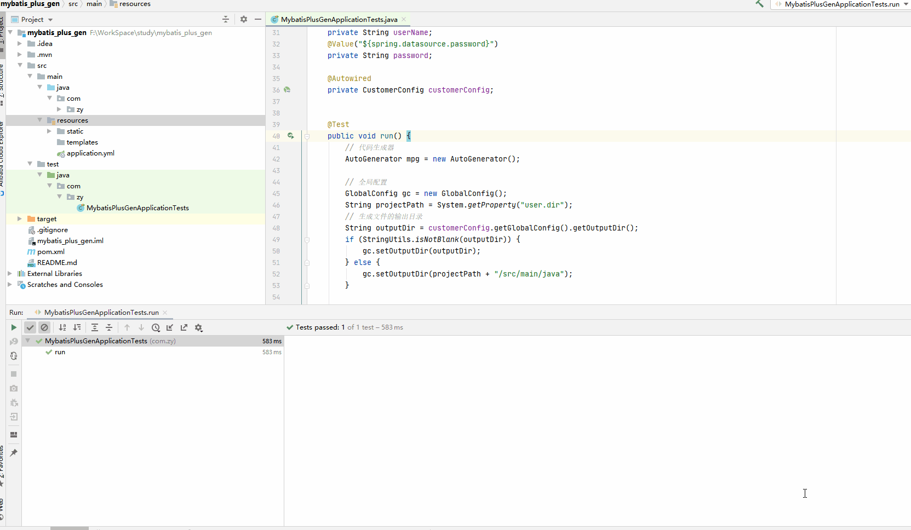
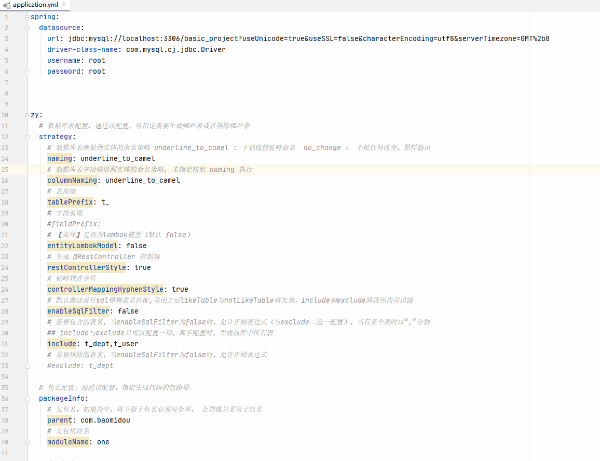

## MybatisPlus代码生成器
### 根据数据库表生成Mybatis Plus的Mapper、Service、Controller等
### 使用方法
1. “zy.strategy.include”：配置指定需要包含的表名,多个表名以“,”分割  
#### 启动test包下MybatisPlusGenApplicationTests下的run()方法生成 

#### 如需修改配置请前往application.yml 

#### 官方网站：
1. https://baomidou.com/guide/generator.html
2. https://baomidou.com/config/generator-config.html

**Tips: application.yml文件中  zy开头的为自定义配置，只编写了mybatis-plus代码生成器的部分配置，如需扩充，请自行修改**